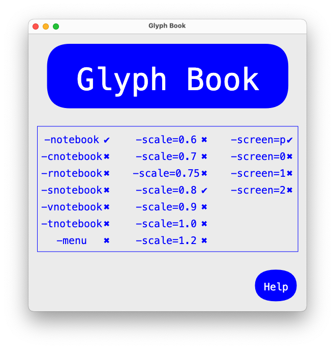
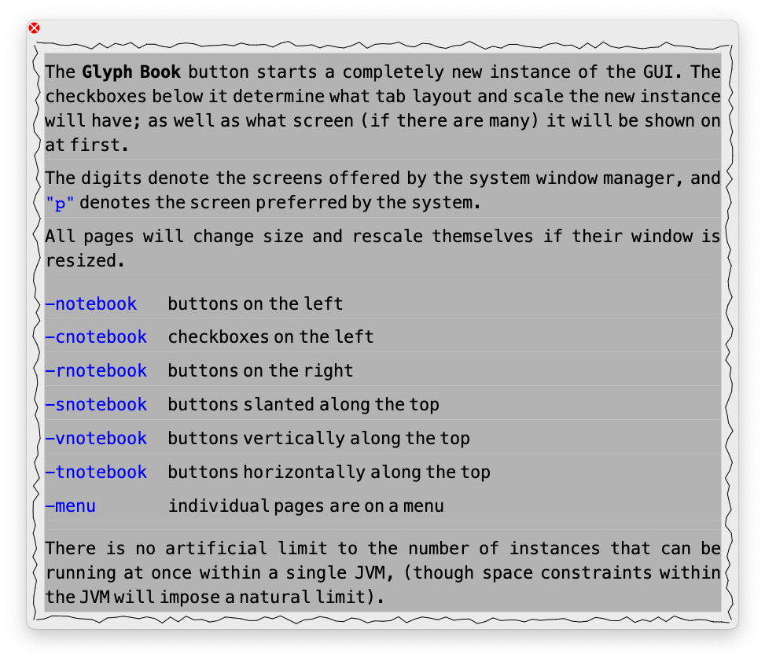
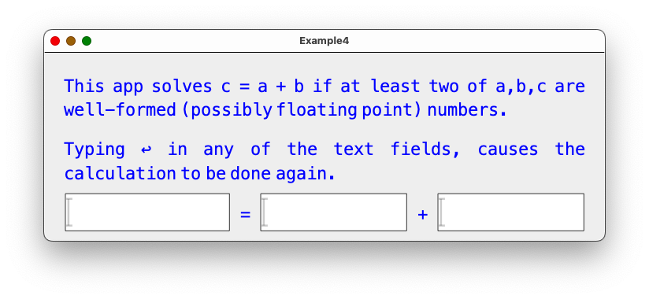

# The Glyph UI Library for Scala

        Bernard Sufrin
        Emeritus: Department of Computer Science
        Oxford University

        (Revised July 9th 2026)
        (Version 1.0.0)
        (scala 2.13.18)


**Glyph** is a (prototype) user-interface library for Scala.
Its graphical features are geometrically compositional: rendered using a
small subset of the facilities of Google's **Skia** 
2-D graphics library, as delivered (in the JVM) by
the **Skija** library.

Our motivation for developing the library was our frustration, over
many years, with complex UI frameworks that impose a uniform style,
and that make it hard to develop novel modes of interaction. There
is nothing wrong with uniform styling: it's the cost of straying
outside the styling envelope that we want to diminish.

The belief that has guided this work is that a rich set of interactive
interface components can be composed using a small collection of
combining forms, together with a suitable collection of elementary
visual components -- some reactive.  So instead of (just) providing
a uniformly-styled “high level” toolkit, we have provided enough
elements and combining forms for an innovative UI designer to
experiment with, and a collection of implementations of conventional
components (for example buttons, checkboxes, text input components,
tabbed-notebooks) to serve as models. Its component-styling framework
straightforwardly supports the separation of component functionality from
component appearance; and although we have not yet done so, we think
it would be straightforward for a developer to generalize it into
a system of application “skins”.

**Glyph** has been tested on `OS/X` (x86 and Mx processors), `Linux` (x86),
and `Windows.` 

## Documentation

A draft introduction to **Glyph** appears in `Glyph-Document/Glyph.pdf` --
which provides a few explained examples of
**GUI**s (**G**lyph **U**ser **I**nterfaces). Prospective
users may also want to read the source code of one or more of the
demonstration/test programs.

### Acknowledgement: Skija and JWM
Whilst Glyph's conceptual model is independent, and more abstract,
than those of Skija and of JWM it could not have been constructed without 
them, and a proper understanding of the implementation of its
lower level modules may be helped by browsing 

1. Skija documentation  [https://tanikaze.icu/Skija-Docs/](https://tanikaze.icu/Skija-Docs/)
or source [https://github.com/HumbleUI/Skija](https://github.com/HumbleUI/Skija)

2. JWM documentation [https://i10416.github.io/JWM/](https://i10416.github.io/JWM/)
or source [https://github.com/humbleUI/JWM](https://github.com/humbleUI/JWM)


## Getting Started
The repository has all the Skija/Skia/JWM jar files needed to support
building and using **Glyph**. I maintain the code using **IntelliJ**, and
the repository has all the appropriate configuration files for that
IDE.

## Getting Started (Mill)
You should be able to **build** the toolkit distribution directory 
out of the box (ie the GitHub source distribution), if you have  **mill** installed. 
The shell command: 

    mill Distribution.dist

generates (in the project root directory), the directory

    out/Distribution/dist.dest/Glyph-1.0.0/

that contains all the jars necessary to run or compile a Glyph-based
program *on a wide variety of hardware architectures and operating systems*.

In that same directory you will find several *launcher scripts*. Each, when
invoked, runs a Glyph-based program that demonstrates some (or many) of Glyph's 
features. For example

        out/Distribution/dist.dest/Glyph-1.0.0/book

demonstrates many aspects of the Glyph library by offering the choice of
several demonstration interfaces. 





The nontrivial launchers are

        barents
        book
        calc
        gridz
        play
        resizeable
        split

and some smaller examples, discussed in the introduction, are

        example1
        example2
        example3
        example3a
        example3b
        example3c
        example3d
        example3e
        example3f

The launchers are virtually identical: setting up the java class path then
running the jvm with an appropriate main class.

## Getting Started (IntelliJ + Mill)
Once the mill build is operational you can import everything into IntelliJ
by first running (in the project root directory)

        mill --bsp-install

then opening the project root directory in IntelliJ. 


## Example

Here's a little example taken from the documentation.



````
package org.sufrin.glyph
package tests
import NaturalSize.{Col, Row}
import styled.overlaydialogues.Dialogue.OK
import styled._

class Example4Interface(sheet: StyleSheet) {
  implicit val style: StyleSheet = sheet

  import glyphXML.Language._

  val help: Glyph =
    <div width="45em" align="justify">
    <p>
    This app solves the equation <i>c = a + b</i> if at least two of <i>a, b, c</i>
    are well-formed numbers: possibly floating-point.
    </p>
    <p>
      Typing <tt>↩</tt> (<i>ie. the enter key</i>) in any of the text fields, causes the
      equation to be re-solved.
    </p>
    </div>

  val a, b, c = textField()
  val fields = List(a, b, c)

  val GUI: Glyph = Col(align=Center)(
    help,
    Row(align=Mid)(
      c.framed(),
      Label(" = "),
      a.framed(),
      Label(" + "),
      b.framed()
    )
  ) enlarged 25

  def textField(): TextField = TextField(
    size = 8,
    onEnter = {
      case s: String if s.toDoubleOption.isDefined => calculemus()
      case s: String =>
        OK( <p align="justify" width="20em">The text {s"'$s'"} doesn't look much like a num_ber. Enter it again please.</p> ).InFront(help).start()
    }
  )

  def calculemus(): Unit =
    (
      c.text.toDoubleOption,
      a.text.toDoubleOption,
      b.text.toDoubleOption
    ) match {
      case (None, Some(av), Some(bv)) => c.text = text(av + bv)
      case (Some(cv), Some(av), None) => b.text = text(cv - av)
      case (Some(cv), None, Some(bv)) => a.text = text(cv - bv)
      case (Some(cv), Some(av), Some(bv)) =>
        if (cv == av + bv) {} else c.text = text(av + bv)
      case _ =>
    }

  def text(d: Double): String = f"$d%.5g"

  def clear(): Unit = {
    for { field <- fields } field.text = ""
  }
}

object Example4 extends Application {
  val sheet: StyleSheet = StyleSheet()
  val GUI: Glyph = new Example4Interface(sheet).GUI
  override def title: String = "Example4"
}

````

## Appendix: Getting Started (**sbt**)
I advise you to think again, and to read no further unless you like 
pathologists' reports.

I admit that I used **sbt** in earlier releases of this (and other) projects; but I no longer have
confidence in my ability to explain it to myself or anybody else who
might be thinking of using it as a serious build tool *and who does not to waste hours*.
I gave it up when build problems were taking an ever-larger fraction of the time it
would take me to solve technical problems.

I predicted in my keynote address to the IFIP 11th World Congress in 1989 that once we had mastered abstract
specifications, program refinement, and the formal semantics of programming languages, the next huge problem
was going to be with the semantics  of configuration languages. I showed that even the 
--apparently simple-- **make** beloved of developers then (and now) had ambiguities in
its documentation that led to an unclear conceptual model: leaving *experiment* as 
the only recourse for people who wanted to use it for nontrivial builds.

But at least **make** had short documentation! **SBT**, whose
documentation the last time I looked occupied several hindreds of pages, 
is not just a build language, it’s a programmable build 
language with emergent semantics. And that’s where things get slippery.

* it is *almost but not quite* declarative (settings graph, tasks, scopes)
* but expressed in Scala (fully imperative, Turing-complete)
* with lazy evaluation (sometimes) and dynamically-scoped keys (property names)
* yielding a dynamically evolving dependency graph/tree

Instead of a clean “configuration model / dependency tree”, you get:

* a not-consistently-lazily evaluated build program whose component meanings depend
on where they were declared, and in what context they are interpreted. 

Adding extensions (indispensable for a serious engineer) into this mix makes
the "emergent semantics" matter even worse.

