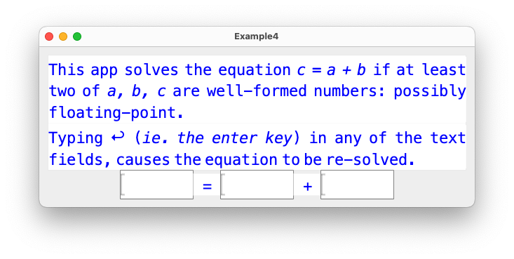

# The Glyph UI Library for Scala

        Bernard Sufrin
        Emeritus: Department of Computer Science
        Oxford University

        (Revised April 3rd 2025)
        (Version 0.9.0)


**Glyph** is a (prototype) user-interface library for Scala.
Its graphical features are geometrically compositional: rendered using a
small subset of the facilities of Google's **Skia** 
2-D graphics library, as delivered (in the JVM) by
the **Skija** library.

Our motivation for developing the library was our frustration, over
many years, with complex UI frameworks that impose a uniform style,
and that make it hard to develop novel modes of interaction. There
is nothing wrong with uniform styling: it's the cost of straying
outside the styling envelope that we want to diminish.

The belief that has guided this work is that a rich set of interactive
interface components can be composed using a small collection of
combining forms, together with a suitable collection of elementary
visual components -- some reactive.  So instead of (just) providing
a uniformly-styled “high level” toolkit, we have provided enough
elements and combining forms for an innovative UI designer to
experiment with, and a collection of implementations of conventional
components (for example buttons, checkboxes, text input components,
tabbed-notebooks) to serve as models. Its component-styling framework
straightforwardly supports the separation of component functionality from
component appearance; and although we have not yet done so, we think
it would be straightforward for a developer to generalize it into
a system of application “skins”.

**Glyph** has been tested on `OS/X` (x86 and Mx processors), `Linux` (x86),
and `Windows.` 

## Documentation

A draft introduction to **Glyph** appears in `Glyph-Document/Glyph.pdf` --
which provides a few explained examples of
**GUI**s (**G**lyph **U**ser **I**nterfaces). Prospective
users may also want to read the source code of the largest
example `demonstrationBook` -- which embodies many
useful **GUIdioms** in its several files.


## Getting Started

The repository has all the Skija/Skia/JWM jar files needed to support
building and using **Glyph**. I maintain the code using **IntelliJ**, and
the repository has all the appropriate configuration files for that
IDE. 

The **sbt** build.sbt file is also set up with the appropriate Skija/JWM dependencies,
and can be used to build the package as a whole, as well as  to run individual test
applications. The following are available:

    [info] * org.sufrin.glyph.GridUtils
    [info] * org.sufrin.glyph.glyphXML.AbstractSyntax
    [info] * org.sufrin.glyph.osBridge.SwingMain
    [info] * org.sufrin.glyph.tests.CalculatorExample
    [info] * org.sufrin.glyph.tests.DocumentationDiagrams
    [info] * org.sufrin.glyph.tests.Example1
    [info] * org.sufrin.glyph.tests.Example2
    [info] * org.sufrin.glyph.tests.Example3
    [info] * org.sufrin.glyph.tests.Example3a
    [info] * org.sufrin.glyph.tests.Example3b
    [info] * org.sufrin.glyph.tests.Example3c
    [info] * org.sufrin.glyph.tests.Example3d
    [info] * org.sufrin.glyph.tests.Example3e
    [info] * org.sufrin.glyph.tests.Example3f
    [info] * org.sufrin.glyph.tests.Example4
    [info] * org.sufrin.glyph.tests.HandleQuit
    [info] * org.sufrin.glyph.tests.LargeTest
    [info] * org.sufrin.glyph.tests.ResizeAndSplitTest
    [info] * org.sufrin.glyph.tests.ResizeableWIndowTest
    [info] * org.sufrin.glyph.tests.demonstrationBook.Pages
    [info] * org.sufrin.glyph.tests.glyphXMLTest

You can run any of them with (eg)

    sbt "runMain org.sufrin.glyph.tests.Example4"

or from inside sbt in response to the sbt prompt:

    sbt:Glyph> runMain org.sufrin.glyph.tests.Example4

But if you don't want to have any truck with an IDE, and if you cannot
be bothered to learn anything about **sbt** (it really *is* a
bother), then you can use the shell script:

        Script/compile

to compile the library (to GETTINGSTARTED/Glyph.jar), and
the script:

        Script/run <test-name> <arguments>

to run any of the tests. If no <test-name> is given, then

        demonstrationBook.Pages

is run.


A moderately experienced Scala programmer should be able to
adapt these scripts.

## Example

Here's a little example taken from the documentation.



````
package org.sufrin.glyph
package tests
import NaturalSize.{Col, Row}
import styled.overlaydialogues.Dialogue.OK
import styled._

class Example4Interface(sheet: StyleSheet) {
  implicit val style: StyleSheet = sheet

  import glyphXML.Language._

  val help: Glyph =
    <div width="45em" align="justify">
    <p>
    This app solves the equation <i>c = a + b</i> if at least two of <i>a, b, c</i>
    are well-formed numbers: possibly floating-point.
    </p>
    <p>
      Typing <tt>↩</tt> (<i>ie. the enter key</i>) in any of the text fields, causes the
      equation to be re-solved.
    </p>
    </div>

  val a, b, c = textField()
  val fields = List(a, b, c)

  val GUI: Glyph = Col(align=Center)(
    help,
    Row(align=Mid)(
      c.framed(),
      Label(" = "),
      a.framed(),
      Label(" + "),
      b.framed()
    )
  ) enlarged 25

  def textField(): TextField = TextField(
    size = 8,
    onEnter = {
      case s: String if s.toDoubleOption.isDefined => calculemus()
      case s: String =>
        OK( <p align="justify" width="20em">The text {s"'$s'"} doesn't look much like a num_ber. Enter it again please.</p> ).InFront(help).start()
    }
  )

  def calculemus(): Unit =
    (
      c.text.toDoubleOption,
      a.text.toDoubleOption,
      b.text.toDoubleOption
    ) match {
      case (None, Some(av), Some(bv)) => c.text = text(av + bv)
      case (Some(cv), Some(av), None) => b.text = text(cv - av)
      case (Some(cv), None, Some(bv)) => a.text = text(cv - bv)
      case (Some(cv), Some(av), Some(bv)) =>
        if (cv == av + bv) {} else c.text = text(av + bv)
      case _ =>
    }

  def text(d: Double): String = f"$d%.5g"

  def clear(): Unit = {
    for { field <- fields } field.text = ""
  }
}

object Example4 extends Application {
  val sheet: StyleSheet = StyleSheet()
  val GUI: Glyph = new Example4Interface(sheet).GUI
  override def title: String = "Example4"
}

````

